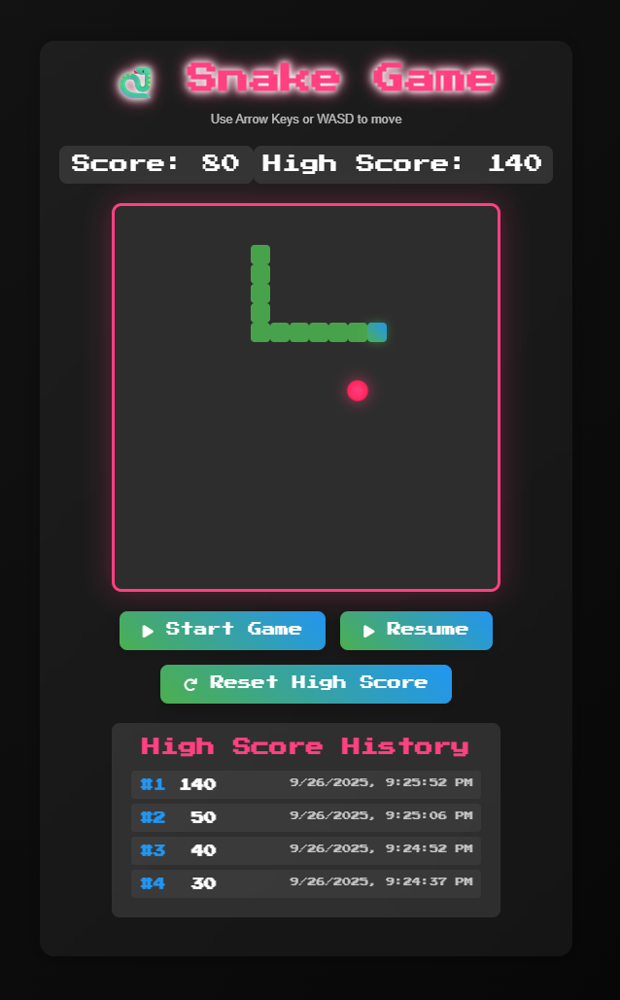

# Snake Game

A classic Snake game built with vanilla HTML, CSS, and JavaScript. This project demonstrates a complete implementation of the popular Snake game with responsive design and modern UI elements.

## 📸 Screenshots



*Gameplay screenshot showing the snake moving around the board with food and score display*

## 🎮 Features

- Classic Snake gameplay mechanics
- Responsive design that works on both desktop and mobile devices
- Score tracking with high score persistence using localStorage
- Mobile touch controls for on-the-go gaming
- Pause/resume functionality
- Dynamic difficulty (speed increases as you play)
- Attractive UI with animations and visual effects
- Collision detection (walls and self-collision)

## 🚀 How to Play

1. Open `index.html` in your web browser
2. Click the "Start Game" button to begin
3. Control the snake using:
   - **Desktop:** Arrow keys or WASD
   - **Mobile:** On-screen directional buttons
4. Eat the red food to grow and increase your score
5. Avoid hitting walls or the snake's own body
6. Press Space or Escape to pause/resume the game

## 🎯 Controls

- **Move Up:** Arrow Up or W
- **Move Down:** Arrow Down or S
- **Move Left:** Arrow Left or A
- **Move Right:** Arrow Right or D
- **Pause/Resume:** Space or Escape

## 📱 Mobile Support

The game is fully responsive and includes dedicated touch controls for mobile devices. On screens smaller than 600px, the game board shrinks and mobile controls appear automatically.

## 🛠️ Technologies Used

- **HTML5:** Semantic markup and structure
- **CSS3:** Styling with Flexbox, Grid, animations, and responsive design
- **JavaScript:** Game logic, event handling, and DOM manipulation
- **Font Awesome:** Icons for buttons and controls
- **Google Fonts:** Stylish "Press Start 2P" font for retro gaming feel

## 🎨 UI Elements

- Neon-themed design with glowing effects
- Animated game elements with CSS
- Smooth transitions and visual feedback
- Game over overlay with final score display
- Score and high score tracking
- Gradient backgrounds and modern styling

## 🗂️ Project Structure

```
snake-game/
├── index.html          # Main HTML structure and game layout
├── style.css           # Styling and responsive design
├── game.js             # Game logic and JavaScript functionality
└── README.md           # This file
```

## 🏆 Scoring

- Each food item eaten: +10 points
- High score is saved in browser's localStorage
- Game speed gradually increases as you progress

## 🤝 Contributing

Contributions are welcome! Feel free to submit a pull request or open an issue for bugs, improvements, or new features.

## 📄 License

This project is open source and available under the MIT License.